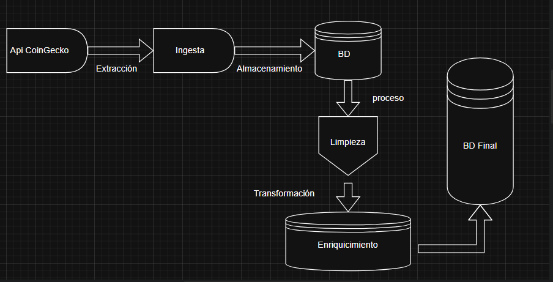

# bigdata20251_actividad_1_2_3_4
# EA4. Proyecto Integrador
# Documentación de la Arquitectura y Modelo de Datos

## Documentacion trabajo final 
## Descripción General de la Arquitectura
# Visión Global:
# Explica de forma global cómo se integran las distintas fases del proyecto (ingesta, preprocesamiento, enriquecimiento ) en el entorno simulado de Big Data en la nube.
### Integración de las Fases del Proyecto de Big Data
### Se integran las tres fases principales del proyecto (Script, CleanData, Transformation) en un flujo de trabajo coherente de procesamiento de datos.
# Arquitectura General del Proyecto
### El proyecto sigue una estructura ETL (Extract, Transform, Load) con tres etapas claramente diferenciadas:
### Extracción (Script): Obtención de datos de la API de CoinGecko
### Limpieza y normalización (CleanData): Depuración y preparación de los datos
### Transformación (Transformation): Enriquecimiento y especialización de los datos

# Componentes Principales:

## Flujo de Integración
### Extracción (script.py)
### Propósito: Obtener datos brutos de la API
### Componentes clave:
### Conexión a la API de CoinGecko
### Normalización del JSON recibido
### Almacenamiento inicial en SQLite y archivos XLSX

## Salidas:
### Archivo request_api_xlsx.xlsx
### Tabla api_exchange en bd_analisis.sqlite

## Limpieza y Normalización (cleanData.py)
## Propósito: Preparar los datos para análisis
## Componentes clave:
## Lectura desde la tabla api_exchange
## Eliminación de duplicados
## Conversión de tipos de datos
## Manejo de valores nulos
## Normalización de texto (minúsculas/mayúsculas)

## Salidas:

### Archivos CSV y XLSX limpios
### Tabla api_clean en bd_analisis.sqlite

## Transformación (transformation.py)
### Propósito: Crear vistas especializadas y enriquecer los datos
## Componentes clave:
### Creación de bases de datos especializadas (bd_info.sqlite, bd_market.sqlite)
### Normalización avanzada de datos
### Cálculo de métricas derivadas
### Validación de consistencia

## Salidas:

### Bases de datos especializadas
### Archivos enriquecidos en CSV y XLSX
### Reporte de auditoría

# Describe los componentes críticos: la base de datos analítica (SQLite), los scripts de procesamiento (ingesta, limpieza y enriquecimiento) y el mecanismo de automatización.

## Base de datos SQLite como puente:
### La fase 1 escribe en bd_analisis.sqlite
### La fase 2 lee desde esta misma base
### La fase 3 puede operar independientemente o sobre datos limpios

## Estructura de archivos común:
### Todas las fases usan create_file para exportar resultados
### Rutas estandarizadas (src/static/xlsx/, src/static/cleaned_data/)
## Sistema de logging:
### La fase 2 usa log_step para registrar el proceso
### La fase 3 implementa logging avanzado con Python

## Componentes compartidos:
### Todas las fases usan create_connection y create_table
### Comparten helpers como audit_data y create_file

# Diagramas de Arquitectura
### Diagramas de Flujo:

### Elabora uno o más diagramas (por ejemplo, mediante draw.io) que ilustren:
### El flujo de datos desde la extracción del API hasta el almacenamiento en la base de datos.
### El proceso de preprocesamiento, enriquecimiento.
### Asegúrate de que los diagramas sean claros y estén correctamente etiquetados.

# Flujo de Datos

