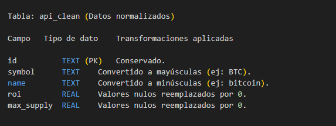
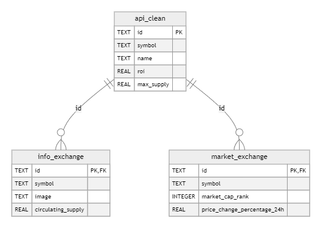

# bigdata20251_actividad_1_2_3_4
# EA4. Proyecto Integrador
# Documentación de la Arquitectura y Modelo de Datos

## Documentacion trabajo final 
## Descripción General de la Arquitectura
# Visión Global:
#### Explica de forma global cómo se integran las distintas fases del proyecto (ingesta, preprocesamiento, enriquecimiento ) en el entorno simulado de Big Data en la nube.
##### Integración de las Fases del Proyecto de Big Data
##### Se integran las tres fases principales del proyecto (Script, CleanData, Transformation) en un flujo de trabajo coherente de procesamiento de datos.
# Arquitectura General del Proyecto
##### Limpieza y normalización (CleanData): Depuración y preparación de los datos
##### Transformación (Transformation): Enriquecimiento y especialización de los datos

# Componentes Principales:

## Flujo de Integración
### Extracción (script.py)
### Propósito: Obtener datos brutos de la API
### Componentes clave:
### Conexión a la API de CoinGecko
### Normalización del JSON recibido
### Almacenamiento inicial en SQLite y archivos XLSX

## Salidas:
### Archivo request_api_xlsx.xlsx
### Tabla api_exchange en bd_analisis.sqlite

### Limpieza y Normalización (cleanData.py)
### Propósito: Preparar los datos para análisis
### Componentes clave:
### Lectura desde la tabla api_exchange
### Eliminación de duplicados
### Conversión de tipos de datos
### Manejo de valores nulos
### Normalización de texto (minúsculas/mayúsculas)

## Salidas:

### Archivos CSV y XLSX limpios
### Tabla api_clean en bd_analisis.sqlite

## Transformación (transformation.py)
### Propósito: Crear vistas especializadas y enriquecer los datos
## Componentes clave:
### Creación de bases de datos especializadas (bd_info.sqlite, bd_market.sqlite)
### Normalización avanzada de datos
### Cálculo de métricas derivadas
### Validación de consistencia

## Salidas:

### Bases de datos especializadas
### Archivos enriquecidos en CSV y XLSX
### Reporte de auditoría

# Describe los componentes críticos: la base de datos analítica (SQLite), los scripts de procesamiento (ingesta, limpieza y enriquecimiento) y el mecanismo de automatización.

## Base de datos SQLite como puente:
### La fase 1 escribe en bd_analisis.sqlite
### La fase 2 lee desde esta misma base
### La fase 3 puede operar independientemente o sobre datos limpios

## Estructura de archivos común:
### Todas las fases usan create_file para exportar resultados
### Rutas estandarizadas (src/static/xlsx/, src/static/cleaned_data/)
## Sistema de logging:
### La fase 2 usa log_step para registrar el proceso
### La fase 3 implementa logging avanzado con Python

## Componentes compartidos:
### Todas las fases usan create_connection y create_table
### Comparten helpers como audit_data y create_file

# Diagramas de Arquitectura
### Diagramas de Flujo:

### Elabora uno o más diagramas (por ejemplo, mediante draw.io) que ilustren:
### El flujo de datos desde la extracción del API hasta el almacenamiento en la base de datos.
### El proceso de preprocesamiento, enriquecimiento.
### Asegúrate de que los diagramas sean claros y estén correctamente etiquetados.

# Flujo de Datos

## diagrama del proceso de limpieza

# Modelo de Datos
## Definición del Esquema:
### Describe el modelo de datos resultante del proceso de integración.

#### El modelo resultante es un esquema relacional organizado en tres bases de datos SQLite especializadas:
#### bd_analisis.sqlite (Datos brutos y limpios).
#### bd_info.sqlite (Metadatos de criptomonedas).
#### bd_market.sqlite (Datos de mercado en tiempo real).

# Tablas y Campos Principales
### Explica las tablas involucradas, sus campos y tipos de datos.
### Detalla las relaciones entre las tablas (por ejemplo, claves primarias y foráneas).

# Diagrama de datos:

### Incluye un diagrama que visualice el modelo de datos, resaltando las interconexiones y la estructura lógica que soporta el análisis en el proyecto.

# Justificación:
##### Explica por qué se diseñó el modelo de datos de esa manera y cómo este modelo facilita la integración y análisis de la información en las etapas posteriores del proyecto.

#### El diseño del modelo se fundamenta en tres principios clave: eficiencia en el almacenamiento, facilidad de análisis y escalabilidad. A continuación, se detalla cómo cada decisión de diseño agrega valor al proyecto:

#### Esquema Relacional Segmentado (Bases de datos especializadas)
### Por qué:
#### Se separó en bd_info (metadatos) y bd_market (datos financieros) para:
#### Optimizar consultas (ej: análisis de precios no requiere cargar imágenes de logos).
#### Cumplir con el principio de separación de preocupaciones.
#### La tabla api_clean en bd_analisis sirve como punto único de verdad para datos depurados

#### Normalización de Datos (Tipos, formatos y nulos)
### Por qué:
#### Campos como symbol (mayúsculas) y name (minúsculas) se estandarizaron para:
#### Evitar duplicados por diferencias de formato (Bitcoin vs bitcoin).
#### Facilitar búsquedas y joins.
#### Los nulos en roi y max_supply se reemplazaron por 0 para:
#### Evitar errores en cálculos matemáticos.

####  Relaciones 1 a 1 (Claves únicas compartidas)
### Por qué:
#### Todas las tablas usan id como PK y FK para:
#### Garantizar integridad referencial (ej: no hay monedas en market_exchange sin su metadata en info_exchange).
#### Permitir joins sin ambigüedades en análisis posteriores.

#### Campos Derivados 
### Por qué:
#### Se calcularon métricas como market_dominance (% del mercado total) y total_valuation durante la transformación para:
#### Evitar reprocesamiento en cada consulta.
#### Centralizar lógica de negocio en un único punto.

#### Diseño para Escalabilidad
#### Decisiones estratégicas:
#### SQLite: Ideal para prototipado, permite migrar fácilmente a PostgreSQL/MySQL.
#### Tablas independientes: Pueden agregarse nuevas fuentes (ej: bd_social para datos de redes sociales) sin modificar el esquema existente.

## Diagrama de Justificación

## SQLite
#### Por qué se eligió:
##### Ligero y autónomo: No requiere servidor externo (ideal para prototipado y pruebas).
##### Compatibilidad: Soporte nativo en Python (módulo sqlite3).
##### Bajo costo operativo: Archivo único (.sqlite) fácil de versionar.

### Contribución al proyecto:
#### Escalabilidad: Permite migrar fácilmente a PostgreSQL/MySQL si el volumen de datos crece.
#### Eficiencia: Consultas rápidas para datasets medianos (<1GB).
#### Mantenibilidad: Backup simplificado (solo copiar el archivo).

## Pandas
### Por qué se eligió:
#### Manipulación intuitiva: Estructuras DataFrame similares a tablas SQL/Excel.
#### Ecosistema robusto: Integración con numpy, matplotlib, y librerías de ML.
#### Optimizado para ETL: Funciones nativas para limpieza (drop_duplicates(), fillna()).

### Contribución al proyecto:
#### Eficiencia: Procesamiento en memoria para datasets que caben en RAM.
#### Mantenibilidad: Código legible (ej: df.merge() vs JOINs SQL complejos).
#### Escalabilidad: Puede combinarse con Dask para paralelización.

## PySpark (Opcional para futuras iteraciones)
### Por qué podría elegirse:
#### Procesamiento distribuido: Escala a terabytes usando clusters (AWS EMR, Databricks).
#### Tolerancia a fallos: Mecanismos de recuperación ante errores.

### Ventajas potenciales:
#### Escalabilidad: Manejo de datos masivos (ej: histórico de años de transacciones).
#### Eficiencia: Operaciones paralelizadas (ej: joins en grandes datasets).

# Nota: En el proyecto actual con datos pequeños, Pandas es suficiente, pero PySpark justificaría su uso en una fase de crecimiento.

## 4. GitHub Actions
### Por qué se eligió:
#### Automatización gratuita: Ejecución de pipelines ETL en eventos (push, schedule).
#### VIntegración nativa: Con repositorios GitHub (no requiere CI externo como Jenkins).

### Contribución al proyecto:
### Mantenibilidad:
#### Ejecuta tests automatizados.
#### Genera reportes de calidad de datos en cada actualización.
### Escalabilidad:
#### Puede desplegar en la nube (AWS/GCP) si el ETL crece.
#### Paraleliza jobs (ej: limpieza y enriquecimiento en simultáneo).

# Flujo de trabajo integrado

# Simulación del Entorno Cloud:

 

## Elementos clave representados:
## Infraestructura Cloud:
#### Máquina virtual Windows Server alojada por GitHub.
#### Recursos asignados (CPU/RAM/almacenamiento).
#### Entorno Python 3.9.2 preconfigurado.
#### Flujo de ejecución:
#### Simulación de un entorno cloud temporal para cada ejecución.
#### Aislamiento del pipeline en un contenedor efímero.

### Persistencia:

### Resultados guardados en el repositorio (no en el runner cloud).

## Flujo de Datos y Automatización

 

# Detalle por Etapas
##### 1. Ingesta (script.py)
##### Fuente: API REST de CoinGecko (JSON).

### Herramientas:

#### python

#### import pandas as pd
#### df = pd.json_normalize(response.json())  # Conversión a DataFrame
#### Salida:

#### Tabla api_exchange en SQLite.

#### Archivo request_api.xlsx.

#### 2. Limpieza (cleanData.py)
#### Procesos:

#### flowchart LR
####     A[Duplicados] -->|drop_duplicates| B[Nulos] -->|fillna(0)| C[Tipos] -->|to_numeric| D[Formato] -->|lower()/upper()| E[Data limpia]
#### Validaciones:

#### Auditoría con df.info() y logs.

#### Salida: Tabla api_clean y archivos CSV/XLSX.

#### 3. Transformación (Transformation.py)
#### Lógica:

#### python
####  Ejemplo: cálculo de métricas
#### df['market_dominance'] = df['market_cap'] / df['market_cap'].sum()

### Bases de datos especializadas:

#### bd_info.sqlite (metadatos).

#### bd_market.sqlite (indicadores financieros).

#### 4. Automatización (GitHub Actions)
#### Flujo:

#### flowchart LR
#### A[Push/Schedule] --> B[Ejecutar CI/CD] --> C[Tests] --> D[ETL] --> E[Commit Resultados]
#### Configuración:

#### yaml
#### on:
####   schedule: - cron: '0 12 * * *'  # Ejecución diaria a las 12 PM UTC

## Diagrama de Secuencia

## Este proyecto  tiene sus espacios definidos (para limpiar, cortar y cocinar los datos), herramientas accesibles (gratuitas y fáciles de usar) y recetas claras (los pasos automatizados). Funciona muy bien para trabajos sencillas (proyectos pequeños), pero si un día quieremos hacer uno mas grande (datos masivos o uso profesional), necesitarás ampliar tu conocimiento.

### Lo que hoy te Tenemos:
####  Simplicidad: Cualquier persona, sin ser experta, puede entender su lógica paso a paso.
####  Ahorro: No requiere inversiones costosas en software o servidores.
####  Adaptabilidad: Si mañana quieres analizar otro tipo de datos (como clima o ventas), el sistema puede ajustarse.

### Sus límites actuales:
#### No es para grandes volúmenes: Como una licuadora doméstica, no procesará toneladas de datos rápidamente.
#### Depende de "ingredientes" externos: Si la API (tu proveedor de datos) falla, el sistema se detiene hasta resolverlo.
####  No "avisa" si algo sale mal: Necesitarías revisarlo manualmente, como una olla sin timbre.

## Cómo mejorarlo, sin complicarse:
#### Si crece tu proyecto: Usa servicios como Google Cloud o AWS (son como cocinas industriales: más potencia por un precio razonable).
####  Para tranquilidad: Conéctalo a Telegram o correo para recibir alertas ("¡Ojo! Hoy no se descargaron los datos").
#### Para tomar decisiones: Añade gráficos fáciles de leer (con herramientas como Power BI), como esos termómetros que te dicen si el pan está listo sin abrir el horno.

## Reflexión final:
## Este sistema es tu asistente confiable para empezar. No tiene que ser perfecto desde el primer día, sino seguro, comprensible y con espacio para crecer. La tecnología debe servirte a ti, no al revés.

##  Recomendaciones Clave para el Futuro
#### 1. Prepararse para Crecimiento
#### Escalar sin dolor: Si los datos aumentan, plataformas como Google Cloud o Azure permitirán almacenar y procesar información masiva sin colapsar.

#### Automatizar aún más: Usar herramientas como Apache Airflow para programar tareas complejas (ej: "Si falla la descarga, reintentar 3 veces antes de avisarme").

#### 2. Hacerlo Más Confiable
#### Plan B para los datos: Configurar copias de seguridad automáticas en la nube (como AWS S3), para que nada se pierda ante imprevistos.

#### Alertas inteligentes: Conectar el sistema a Slack o Microsoft Teams para recibir mensajes como: " Los datos no se actualizaron hoy — ¿falló la API?".

#### 3. Facilitar su Uso Cotidiano
#### Panel visual intuitivo: Herramientas como Tableau o Power BI pueden transformar tablas en gráficos claros, útiles incluso para personas no técnicas.

#### Documentación viva: Un manual interactivo (con ejemplos y soluciones a errores comunes) que crezca junto con el proyecto.

#### 4. Aprovechar la Inteligencia Artificial
#### Detección de anomalías: Modelos simples de IA podrían alertar sobre datos inusuales (ej: "¡El precio de Bitcoin cayó 30% en una hora! ¿Error o realidad?").

#### Predicciones básicas: Con datos históricos, se podrían generar estimaciones (ej: "Tendencia de precios para la próxima semana").
